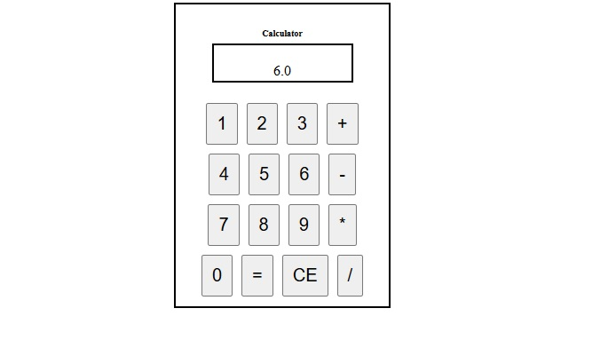

# Dash Calculator App

This is a simple calculator app built using Dash, a Python framework for building analytical web applications. The app provides basic arithmetic operations and is designed to run inside a Docker container.

## Screenshots
[Include some screenshots of your app's UI and functionality]


## Features
- Basic arithmetic operations: addition, subtraction, multiplication, and division.
- A clean, simple UI built with Dash and HTML components.
- Runs inside a Docker container for easy deployment.

## Prerequisites
To run this application, you need to have the following installed:
- [Docker](https://www.docker.com/get-started)
- [Docker Compose](https://docs.docker.com/compose/install/)

- ## Project Structure
```bash
calculator_pro/
│
├── calculator.py       # Main Dash application file
├── Dockerfile          # Dockerfile for building the app container
├── docker-compose.yml  # Docker Compose configuration
├── requirements.txt    # Python dependencies (e.g., Dash)
└── README.md           # Project documentation (this file)

# Getting Started

### Clone the repository
First, clone the repository to your local machine:

```bash
git clone https://github.com/yourusername/calculator_pro.git
cd calculator_pro
```

### Build and Run the Application in Docker
Once you have Docker installed and cloned the repository, follow these steps to run the calculator app:

1. **Build the Docker image**:
   ```bash
   docker-compose up --build
   ```

2. **Access the app**:
   Open your browser and go to `http://localhost:8050` or `http://127.0.0.1:8050` to access the app.

3. **Stop the app**:
   When you're done, you can stop the app by running:
   ```bash
   docker-compose down
   ```

## Running the App Locally (Without Docker)
If you prefer to run the app locally without Docker, you can follow these steps:

1. **Set up a Python virtual environment**:
   ```bash
   python -m venv venv
   source venv/bin/activate  # On Windows use: venv\Scriptsctivate
   ```

2. **Install dependencies**:
   ```bash
   pip install -r requirements.txt
   ```

3. **Run the app**:
   ```bash
   python calculator.py
   ```

4. **Access the app**:
   Go to `http://localhost:8050` or `http://127.0.0.1:8050` in your browser to see the app.

## Files

### `calculator.py`
This is the main application file. It defines the layout of the calculator, including buttons for numbers and operations, and the logic for handling user input and performing calculations.

### `Dockerfile`
The `Dockerfile` contains instructions for building the Docker image. It installs the necessary dependencies, copies the app into the Docker container, and runs the app using Python.
```bash
   FROM python:3.9-slim
   
   WORKDIR /app
   
   COPY . /app
   
   RUN pip install dash
   
   EXPOSE  8050
   
   CMD ["python", "vrenv/Calculator.py"]
   ```

### `docker-compose.yml`
The `docker-compose.yml` file defines the services required to run the app, builds the Docker container, and maps the container's port `8050` to the host machine.

### `requirements.txt`
This file lists the dependencies required for the project (e.g., Dash). When Docker builds the image, it installs the dependencies listed here.

## Acknowledgments
- [Dash by Plotly](https://dash.plotly.com/) - A Python framework for building web applications.
=======


### Key Sections in the README:
1. **Project Overview**: Describes what the app does and provides an introduction.
2. **Prerequisites**: Lists Docker and Docker Compose as prerequisites.
3. **Getting Started**: Instructions for cloning the project, building the Docker container, and running the app.
4. **Project Structure**: Brief description of the files in the project.
5. **Running the App Locally**: Alternative instructions for running the app without Docker, using a Python virtual environment.
6. **File Descriptions**: Describes the purpose of key files such as `calculator.py`, `Dockerfile`, `docker-compose.yml`, and `requirements.txt`.
7. **Acknowledgments**: Mentions Dash, which is the framework used to build the app.


>>>>>>> e193b77731d622ebcabef78947055081e7b60c46
